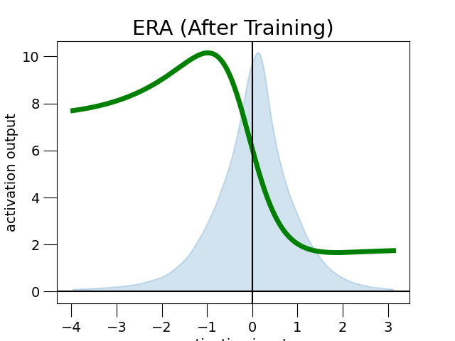

# ERA: Enhanced Rational Activations

## 1. Dependencies
This is the repository of the paper ERA: Enhanced Rational Activations.
The code uses TensorFlow 2.5. For other pip recommended pip packages, please check the requirements.txt file. To run on GPUs, we use CUDA 11.2.2 and CuDNN 8.1.0.77.

## 2. Plots of learned ERAs
Plot of Swish-initialised ERA with denominator of degree 4:

## 3. Citations
asdf
